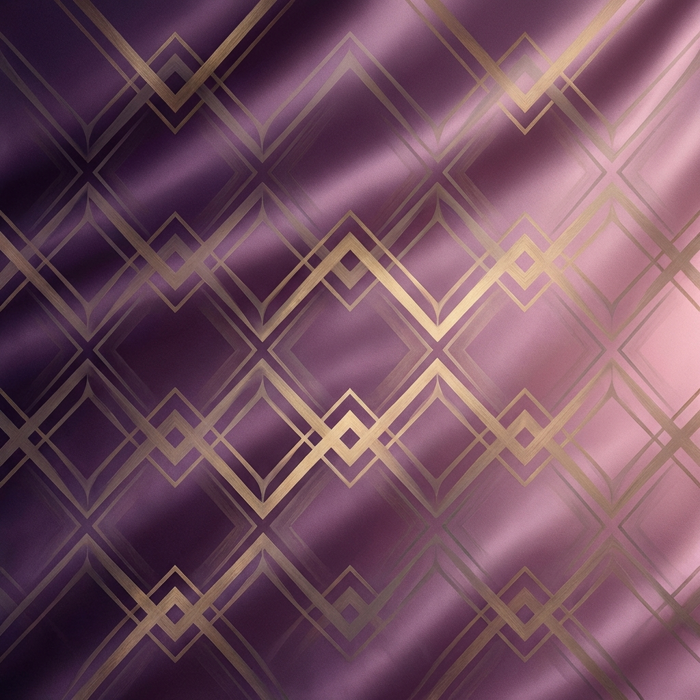

# Zora - Premium E-commerce Clothing Brand

A modern, responsive e-commerce website built with Next.js, TypeScript, and Tailwind CSS, featuring a premium design system and modular component architecture.



## 🌟 Features

- **Premium Design System**: Comprehensive CSS custom properties for colors, typography, spacing, and effects
- **Modular Components**: Reusable UI components following DRY principles
- **Responsive Design**: Mobile-first approach with seamless experience across all devices
- **Modern Tech Stack**: Next.js 16, React 19, TypeScript, Tailwind CSS 4
- **Smooth Animations**: Micro-interactions and transitions for enhanced UX
- **Glassmorphism Effects**: Modern UI aesthetics with backdrop blur effects
- **SEO Optimized**: Proper meta tags and semantic HTML structure

## 🎨 Design System

The project includes a comprehensive design system with:

- **Color Palette**: Premium dark theme with indigo primary, pink secondary, and amber accent colors
- **Typography**: Inter for UI text, Playfair Display for headings
- **Spacing Scale**: Consistent spacing from 4px to 96px
- **Component Library**: Button, Card, Container, Badge components with multiple variants
- **Animations**: Fade-in, slide-in, float, and shimmer effects

## 📁 Project Structure

```
zora-frontend/
├── app/
│   ├── globals.css          # Design system and global styles
│   ├── layout.tsx            # Root layout with fonts
│   └── page.tsx              # Landing page composition
├── components/
│   ├── ui/                   # Reusable UI components
│   │   ├── Button.tsx
│   │   ├── Card.tsx
│   │   ├── Container.tsx
│   │   └── Badge.tsx
│   ├── layout/               # Layout components
│   │   ├── Navbar.tsx
│   │   └── Footer.tsx
│   └── home/                 # Landing page sections
│       ├── HeroSection.tsx
│       ├── FeaturedCollections.tsx
│       ├── NewArrivals.tsx
│       ├── CategoryHighlight.tsx
│       ├── BrandStory.tsx
│       └── Newsletter.tsx
├── public/
│   └── images/               # Static images
└── package.json
```

## 🚀 Getting Started

### Prerequisites

- Node.js 18+ installed
- npm or yarn package manager

### Installation

1. **Clone the repository**

```bash
git clone <your-repository-url>
cd zora-frontend
```

2. **Install dependencies**

```bash
npm install
```

3. **Run the development server**

```bash
npm run dev
```

4. **Open your browser**

Navigate to [http://localhost:3000](http://localhost:3000) to see the website.

## 📜 Available Scripts

- `npm run dev` - Start development server
- `npm run build` - Build for production
- `npm start` - Start production server
- `npm run lint` - Run ESLint

## 🎯 Component Usage

### Button Component

```tsx
import { Button } from '@/components/ui/Button';

<Button variant="primary" size="lg">Shop Now</Button>
<Button variant="outline" size="md">Learn More</Button>
<Button variant="ghost" isLoading>Processing...</Button>
```

**Variants**: `primary`, `secondary`, `outline`, `ghost`  
**Sizes**: `sm`, `md`, `lg`

### Card Component

```tsx
import { Card, CardImage, CardContent } from '@/components/ui/Card';

<Card variant="glass" hover>
  <CardImage src="/image.png" alt="Product" />
  <CardContent>
    <h3>Product Title</h3>
    <p>Description</p>
  </CardContent>
</Card>
```

**Variants**: `default`, `glass`, `elevated`

### Container & Section

```tsx
import { Container, Section } from '@/components/ui/Container';

<Section id="about" className="bg-dark">
  <Container>
    <h2>Content</h2>
  </Container>
</Section>
```

### Badge Component

```tsx
import { Badge } from '@/components/ui/Badge';

<Badge variant="primary">NEW</Badge>
<Badge variant="success" size="md">In Stock</Badge>
```

**Variants**: `primary`, `secondary`, `success`, `warning`, `error`  
**Sizes**: `sm`, `md`

## 🎨 Design Tokens

Access design tokens via CSS custom properties:

```css
/* Colors */
var(--color-primary)
var(--color-secondary)
var(--color-accent)

/* Spacing */
var(--spacing-md)
var(--spacing-xl)

/* Typography */
var(--text-xl)
var(--font-display)

/* Effects */
var(--shadow-glow)
var(--radius-lg)
```

## 📱 Responsive Breakpoints

- **Mobile**: < 768px
- **Tablet**: 768px - 1023px
- **Desktop**: ≥ 1024px

## 🌐 Landing Page Sections

1. **Hero Section**: Full-screen hero with gradient background, CTA buttons, and stats
2. **Featured Collections**: Grid showcase of Women's, Men's, and Accessories collections
3. **New Arrivals**: Product grid with quick view and add to cart
4. **Category Highlight**: Large category cards with hover effects
5. **Brand Story**: Split layout with brand narrative and company stats
6. **Newsletter**: Email signup with gradient background and social proof

## 🎭 Key Features

### Navigation
- Sticky navbar with glassmorphism on scroll
- Mobile hamburger menu with smooth transitions
- Search and shopping cart icons
- Responsive navigation links

### Footer
- Brand information and social media links
- Quick links to shop categories
- Newsletter signup form
- Legal links and copyright

### Animations
- Fade-in effects on scroll
- Hover transformations on cards
- Smooth transitions throughout
- Loading states for interactive elements

## 🛠️ Technologies Used

- **Framework**: Next.js 16.1.1 (App Router)
- **Language**: TypeScript 5
- **Styling**: Tailwind CSS 4
- **Fonts**: Google Fonts (Inter, Playfair Display)
- **Icons**: Inline SVG icons
- **Image Optimization**: Next.js Image component ready

## 📦 Dependencies

```json
{
  "next": "16.1.1",
  "react": "19.2.3",
  "react-dom": "19.2.3",
  "@tailwindcss/postcss": "^4",
  "tailwindcss": "^4",
  "typescript": "^5"
}
```

## 🎨 Color Palette

- **Primary (Indigo)**: `#6366f1`
- **Secondary (Pink)**: `#ec4899`
- **Accent (Amber)**: `#f59e0b`
- **Background**: `#0a0a0a`
- **Surface**: `#171717`
- **Text Primary**: `#fafafa`

## 🚧 Future Enhancements

- [ ] Product detail pages
- [ ] Shopping cart functionality
- [ ] User authentication
- [ ] Payment integration
- [ ] Product search and filtering
- [ ] Wishlist feature
- [ ] Customer reviews
- [ ] Order tracking

## 📄 License

This project is created for demonstration purposes.

## 👥 Author

Built with ❤️ for the Zora clothing brand

---

**Note**: This is a frontend template. Backend integration and e-commerce functionality would need to be added for a production-ready application.
